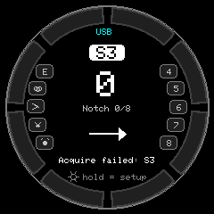
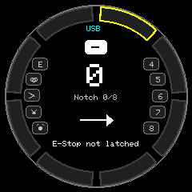
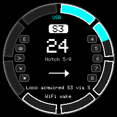
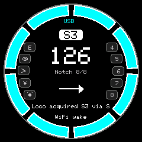
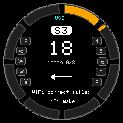
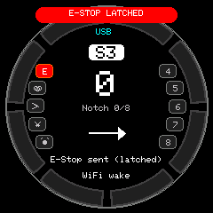
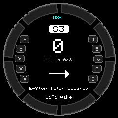
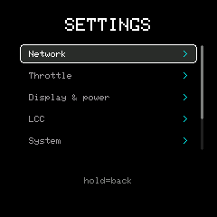

# Dial Throttle (M5Stack Dial + SparkFun Qwiic Numpad)

[](https://github.com/ngpaladi/dial-throttle/actions/workflows/build.yml)

This project turns an `M5Stack Dial` into a handheld model railroad throttle. It talks to JMRI
over WiThrottle, or joins an LCC network directly, with a `SparkFun Qwiic Keypad/Numpad
(COM-15290)` for function, turnout and loco-select keys.

**Documentation: <https://ngpaladi.github.io/dial-throttle/>**

| Idle, no loco | Half-step between notches | Ramping to notch 5 | Full speed |
| --- | --- | --- | --- |
|  |  |  |  |

| Reverse | E-Stop latched | Battery gauge | Settings menu |
| --- | --- | --- | --- |
|  |  |  |  |

## Features

- Notched throttle with momentum on the dial: 4, 8, 12 or 16 notches over speed steps `0..126`.
- Touchscreen brake, dial-button stop and direction change, and a latched emergency stop.
- WiThrottle for JMRI, or LCC / OpenLCB over GridConnect as a real node.
- Keypad functions, turnouts and loco selection, plus RFID loco selection with an optional
  MySQL lookup.
- WiFi, server and throttle settings stored in flash and editable on the device.
- Idle power saving for battery use that never cuts the link while the train is moving.

## Parts

| Qty | Part | Description |
| --- | --- | --- |
| 1 | `K130-V11` | M5Stack Dial |
| 1 | `15290` | SparkFun Qwiic Keypad, 12 button |
| 1 | `15109` | Qwiic to I2C Grove cable, 150 mm |
| 1 | `LION-1865-34` | 18650 Li-ion cell, 3.7 V 3.4 Ah |
| 1 | `BH-18650-PC` | 18650 holder, PC pin |
| 1 | `3922` | Molex Pico Blade 2-pin cable |
| 1 | `FE-USB2CC-PM-6IN` | Panel-mount USB-C cable, 6 in |

`parts/partslist.csv` has the Digi-Key numbers, and the
[Parts page](https://ngpaladi.github.io/dial-throttle/docs/parts/) explains what each item is for
and what the optional additions are.

## Quick start

With [arduino-cli](https://arduino.github.io/arduino-cli/) and `make`:

```bash
make flash PORT=/dev/ttyACM0   # build and upload; the first build downloads the ESP32 core
make monitor                   # serial console at 115200 baud
make help                      # every target
```

Or run the guided installer, which fetches arduino-cli for you: `./install.sh` on Linux and
macOS, `.\install.ps1` or `install.bat` on Windows.

To use the Arduino IDE, open `DialThrottle/DialThrottle.ino` and follow the board settings in
[Getting started](https://ngpaladi.github.io/dial-throttle/getting-started/#build-with-the-arduino-ide).

A unit with nothing saved opens its settings menu on first boot, so WiFi and the server can be
set on the device. Compile-time defaults are in `DialThrottle/config.h`.

## Repository layout

| Path | Contents |
| --- | --- |
| `DialThrottle/` | Arduino sketch: firmware, `config.h`, and `sketch.yaml` with pinned versions |
| `Makefile` | Build, flash, monitor and docs targets |
| `install.py` | Guided installer (`install.sh`, `install.ps1` and `install.bat` wrap it) |
| `docs/` | Hugo documentation site |
| `parts/partslist.csv` | Parts list, rendered on the site's Parts page |
| `tools/screenshot.py` | Captures the screen over serial |
| `case/` | Printable case |
| `rfid_mysql_schema.sql` | Sample table for RFID lookups |

## Documentation site

The site in `docs/` is built with [Hugo](https://gohugo.io/) and published to GitHub Pages by
`.github/workflows/pages.yml` on every push that touches `docs/` or `parts/`.

```bash
make serve                     # dev server with live reload on :1313
make docs                      # build into docs/public
```

The Parts page is generated from `parts/partslist.csv`, so editing that CSV updates the
documentation. `make site-assets` restages it, and `make docs` and `make serve` do that for you.
